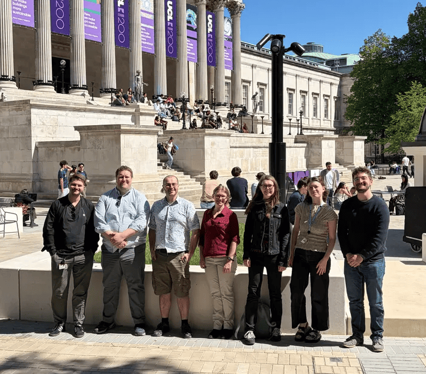
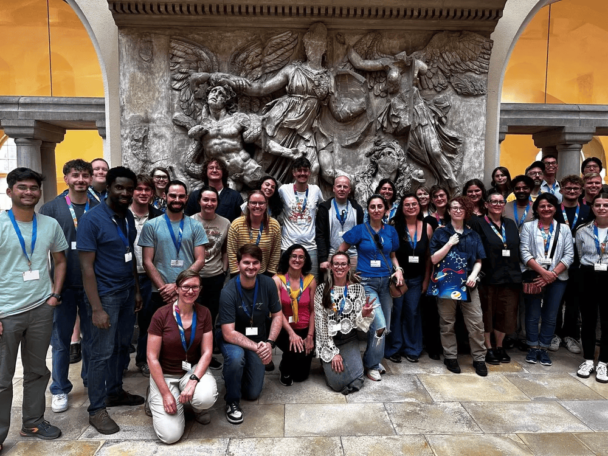

# About us

## What is Palaeoverse?

Palaeoverse is a community-driven initiative advancing open science in palaeontology through shared tools, training, and resources.

Founded in 2022 by Lewis A. Jones, Palaeoverse grew out of a simple but widespread frustration: palaeontologists were independently reinventing the same workflows. Without standard tools or protocols for cleaning and preparing data, duplicated effort was the norm and reproducibility suffered. A group of early-career researchers decided to do something about it.

The result was the [palaeoverse R package](https://palaeoverse.palaeoverse.org/), a toolkit designed to streamline data preparation and exploration for palaeontological research. What began as a pragmatic solution to a shared problem has since grown into something larger: a formally organised initiative spanning a full software ecosystem, hands-on training workshops, community resources, and spaces for researchers at all career stages to connect and collaborate.

 

{width="75%" fig-align="center" fig-alt="Members of the Palaeoverse team meeting in London in April 2026. From left to right: Lewis A. Jones, Will Gearty, Joseph Flannery-Sutherland, Erin Dillon, Bethany Allen, Cecily Nicholl, Etienne Bacher."}

 

## Our Impact

We contribute to making palaeontology a more open, reproducible, and supportive discipline.

- We develop and maintain software toolkits to support palaeontological research
- We have trained 150+ researchers in R, open science, collaboration, and reproducibility through our workshops
- We have organised 30+ online events, including lecture series, workshops, and open calls for the community
- We run community spaces to offer a platform for palaeontologists to engage in healthy discussion, advertise opportunities, share new publications, and support one another

 

{width="70%" fig-align="center"}

 

## Contact Us

Email: [info@palaeoverse.org](mailto:info@palaeoverse.org)

Address: Palaeoverse, G02, Department of Earth Sciences, University College London, 5 Gower Pl, London WC1E 6BS, UK

[Current and past members of the Palaeoverse team](../../about/people/) are based all over the world, including Brazil, France, Germany, Panama, Switzerland, UK, USA, and more. Reach out if you have any questions, would like more information, or would like to work with us.
