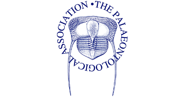
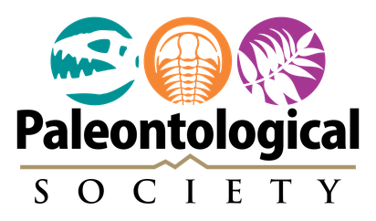
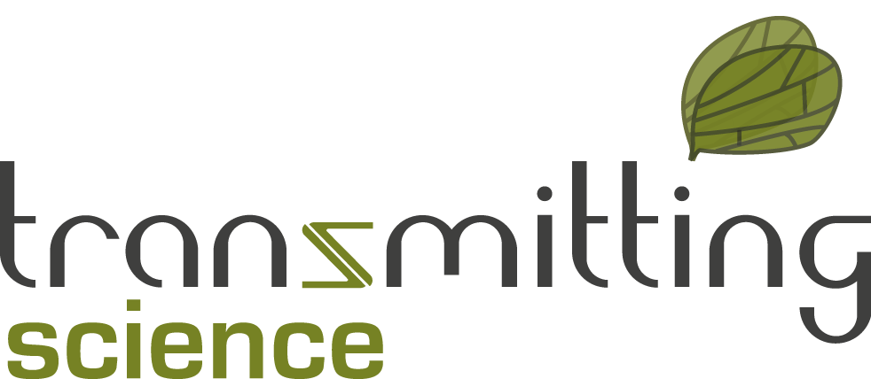
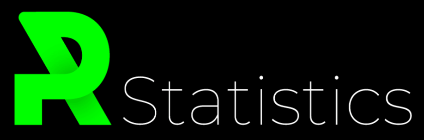
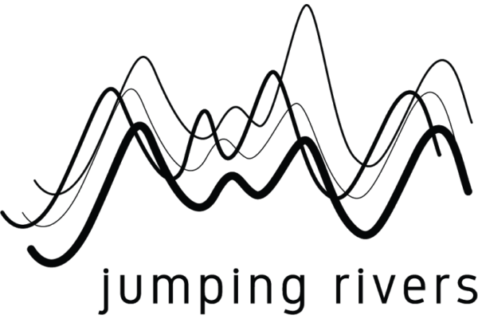

Palaeoverse is currently (March 2026 to February 2028) supported by the UKRI via the [Software Sustainability Institute](https://www.software.ac.uk/)’s Research Software Maintenance Fund (AH/Z000114/1).

Since 2022, Palaeoverse, and its activities, have received support from a number of organisations. Click a logo to read more about their contribution.

::: {.logo-wall}
{group="sponsors" title="Zulip — March 2026" description="Zulip is an organized team chat app designed for efficient communication. It sponsors our access to the Zulip Cloud Standard."}

{group="sponsors" title="Software Sustainability Institute — February 2026" description="Funding from the Software Sustainability Institute's Research Software Maintenance Fund (AH/Z000114/1), supported by UKRI. This funding runs until February 2028."}

{group="sponsors" title="Swiss National Science Foundation — 2024" description="A Scientific Exchange grant from the Swiss National Science Foundation supported the development of the rmacrostrat R package."}

{group="sponsors" title="The Palaeontological Association — 2022/2023" description="Grant-in-Aid (PA-GA202203, awarded in 2022) and sponsored prizes for the “R for Palaeobiologists: Workshop and Hackathon” at University College London (September 2023)."}

{group="sponsors" title="The Palaeontological Society — 2023" description="A meeting support grant for the “R for Palaeobiologists: Workshop and Hackathon” at University College London (September 2023)."}

{group="sponsors" title="Transmitting Science — 2023" description="Sponsored prizes for the “R for Palaeobiologists: Workshop and Hackathon” at University College London (September 2023)."}

{group="sponsors" title="PRStatistics — 2023" description="Sponsored prizes for the “R for Palaeobiologists: Workshop and Hackathon” at University College London (September 2023)."}

{group="sponsors" title="Jumping Rivers — 2023" description="Sponsored prizes for the “R for Palaeobiologists: Workshop and Hackathon” at University College London (September 2023)."}
:::
