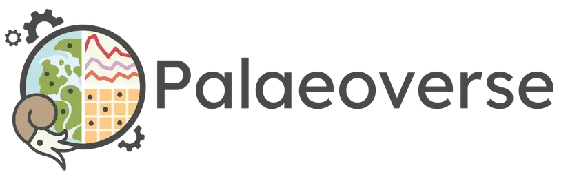

---
# This ensures that the brpwser tab has the name "Palaeoverse".
# Do not use "title" param because we don't want this to appear 
# on the page.
pagetitle: "Palaeoverse"
toc: false
engine: knitr
# Used so that we can apply some custom CSS to classes that appear
# on all pages but that we want to customize on the homepage only.
body-classes: homepage
---

```{=html}
<div class="hero">
  
</div>
<p class="tagline">Palaeoverse is a community-driven initiative advancing open science in palaeontology through shared tools, training, and resources.</p>
<div class="hero-buttons">
  <a href="zulip/join-zulip" class="landing-page-btn">Join the community on Zulip</a>
  <a href="our-packages" class="landing-page-btn">Check out our packages</a>
  <a href="events" class="landing-page-btn">See our next events</a>
  <a href="training/lecture-series" class="landing-page-btn">Attend our lecture series</a>
  <a href="training/modules" class="landing-page-btn">See our modules</a>
</div>
```

```{r}
#| echo: false
### Number of citations
library(openalexR)
citations_raw <- oa_fetch(
  entity = "works",
  doi = c(
    # palaeoverse
    "https://doi.org/10.1111/2041-210x.14099",
    # rmacrostrat
    "10.1130/GES02815.1",
    # rphylopic
    "10.1111/2041-210X.14221",
    # sepkoski
    "10.5281/zenodo.7342194"
  )
)

citations <- citations_raw[, c("title", "cited_by_count")]

total_citations <- sum(citations$cited_by_count)

### Alternative with scholar which works locally but always has a warning
### "Cannot connect to Google Scholar. Is the ID you provided correct?"
### in CI.
# library(scholar)

# lewis_id <- "X0AvsOkAAAAJ"
# palaeoverse_id <- "YsMSGLbcyi4C"
# rphylopic_id <- "_FxGoFyzp5QC"
# rmacrostrat_id <- "ZeXyd9-uunAC"

# palaeoverse_citations <- get_article_cite_history(
#   lewis_id,
#   palaeoverse_id
# )$cites
# rphylopic_citations <- get_article_cite_history(lewis_id, rphylopic_id)$cites
# rmacrostrat_citations <- get_article_cite_history(
#   lewis_id,
#   rmacrostrat_id
# )$cites

# total_citations <- sum(
#   palaeoverse_citations,
#   rphylopic_citations,
#   rmacrostrat_citations
# )

### Number of downloads
n_downloads <- cranlogs::cran_downloads(
  packages = c("palaeoverse", "sepkoski", "rphylopic", "rmacrostrat"),
  from = "2015-01-01",
  to = Sys.Date()
)
```

```{=html}
<div class="stats-section">
  <div class="stat-item">
    <div class="stat-value">
      <span class="stat-number" data-target=`r paste0(sum(n_downloads$count))`>0</span>
    </div>
    <span class="stat-label">Package Downloads</span>
  </div>
  <div class="stat-item">
    <div class="stat-value">
      <span class="stat-number" data-target=`r paste0(total_citations)`>0</span>
    </div>
    <span class="stat-label">Citations</span>
  </div>
</div>

<script>
(function () {
  function animateCounter(el) {
    var target = parseInt(el.dataset.target, 10);
    var duration = 800;
    var start = performance.now();
    function update(now) {
      var progress = Math.min((now - start) / duration, 1);
      var eased = 1 - Math.pow(1 - progress, 3);
      el.textContent = Math.round(eased * target).toLocaleString();
      if (progress < 1) requestAnimationFrame(update);
    }
    requestAnimationFrame(update);
  }

  var observer = new IntersectionObserver(function (entries) {
    entries.forEach(function (entry) {
      if (entry.isIntersecting) {
        animateCounter(entry.target);
        observer.unobserve(entry.target);
      }
    });
  }, { threshold: 0.4 });

  document.querySelectorAll('.stat-number').forEach(function (el) {
    observer.observe(el);
  });
})();
</script>
```
