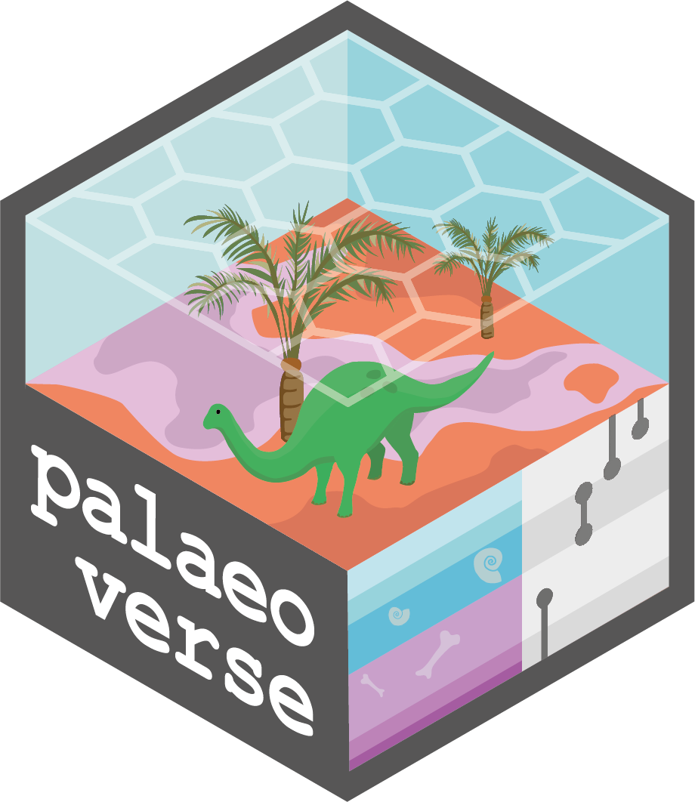
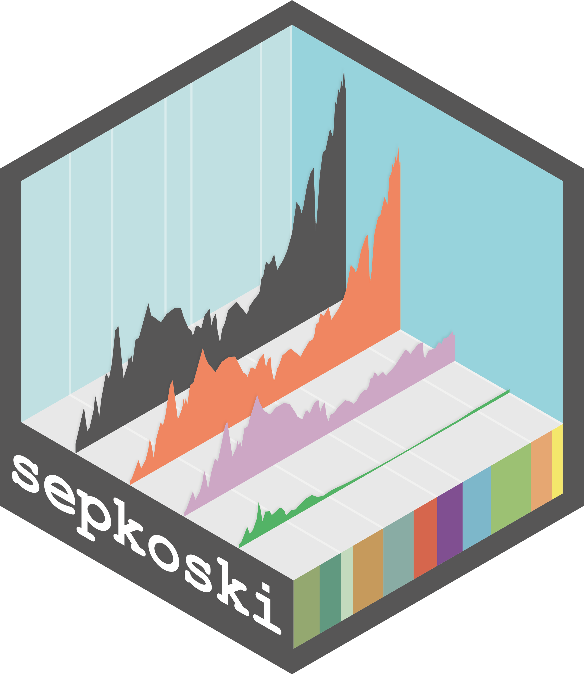

::: {.package-grid}

::: {.package-card}
{.package-hex}

### palaeoverse

[Prepare and Explore Data for Palaeobiological Analyses]{.package-subtitle}

::: {.package-actions}
[Website](https://palaeoverse.palaeoverse.org/){.package-btn target="_blank"}

<i class="bi bi-star-fill"></i>–
<a href="https://github.com/palaeoverse/palaeoverse" target="_blank" class="package-repo"><i class="bi bi-github"></i></a>
:::
:::

::: {.package-card}
{.package-hex}

### rmacrostrat

[Fetch Geologic Data from the 'Macrostrat' Platform]{.package-subtitle}

::: {.package-actions}
[Website](https://rmacrostrat.palaeoverse.org/){.package-btn target="_blank"}

<i class="bi bi-star-fill"></i>–
<a href="https://github.com/palaeoverse/rmacrostrat" target="_blank" class="package-repo"><i class="bi bi-github"></i></a>
:::
:::

::: {.package-card}
{.package-hex}

### rphylopic

[Get Silhouettes of Organisms from PhyloPic]{.package-subtitle}

::: {.package-actions}
[Website](https://rphylopic.palaeoverse.org/){.package-btn target="_blank"}

<i class="bi bi-star-fill"></i>–
<a href="https://github.com/palaeoverse/rphylopic" target="_blank" class="package-repo"><i class="bi bi-github"></i></a>
:::
:::

::: {.package-card}
{.package-hex}

### sepkoski

[Sepkoski's Fossil Marine Animal Genera Compendium]{.package-subtitle}

::: {.package-actions}
[Website](https://sepkoski.palaeoverse.org/){.package-btn target="_blank"}

<i class="bi bi-star-fill"></i>–
<a href="https://github.com/LewisAJones/sepkoski" target="_blank" class="package-repo"><i class="bi bi-github"></i></a>
:::
:::

:::

