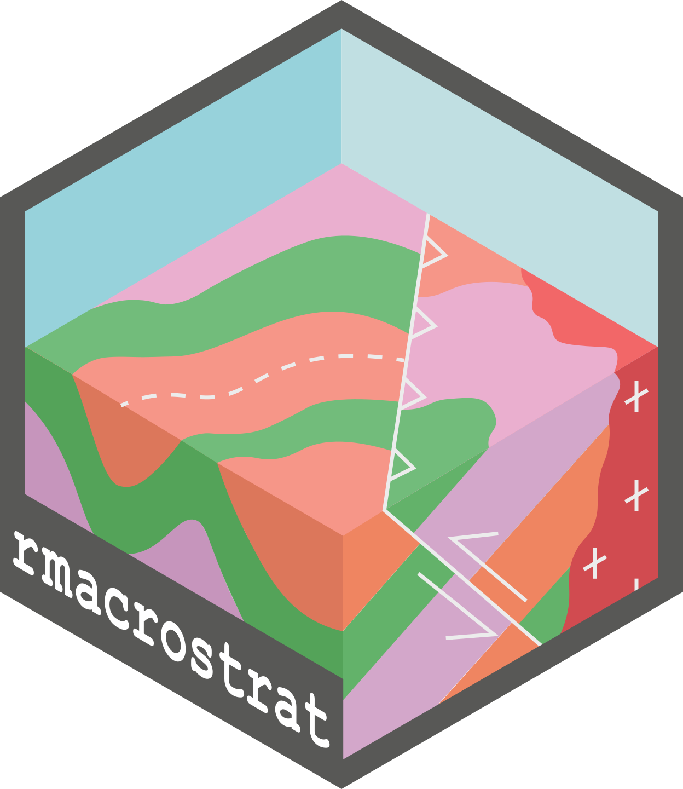
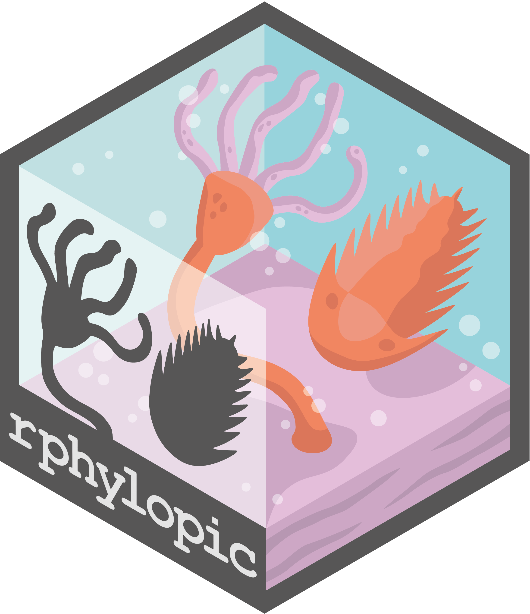
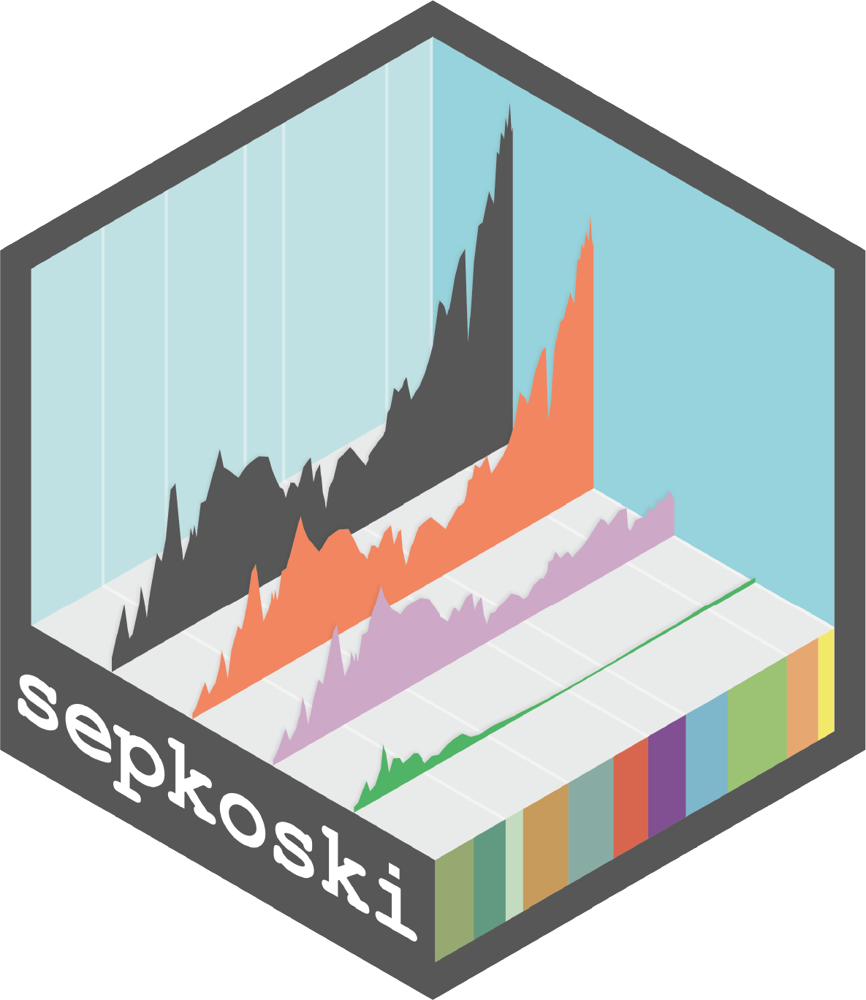

```{r}
#| echo: false
library(cranlogs)
n_downloads <- cranlogs::cran_downloads(
  packages = c("palaeoverse", "sepkoski", "rphylopic", "rmacrostrat"),
  from = "2015-01-01",
  to = Sys.Date()
)
n_downloads <- n_downloads[, c("count", "package")]
n_downloads <- tapply(n_downloads$count, n_downloads$package, sum)
nms <- names(n_downloads)
n_downloads <- round(n_downloads, digits = 1)
n_downloads <- paste0(round(n_downloads, digits = -3) / 1000, "k+")
names(n_downloads) <- nms
```

::: {.package-grid}

::: {.package-card}
{.package-hex}

### palaeoverse

[Prepare and Explore Data for Palaeobiological Analyses]{.package-subtitle}

::: {.package-actions}
<span class="package-stars" data-repo="palaeoverse/palaeoverse"><i class="bi bi-star-fill"></i><span class="star-count">–</span></span>
<a href="https://github.com/palaeoverse/palaeoverse" target="_blank" class="package-repo"><i class="bi bi-github"></i></a>
<span><i class="bi bi-download"></i><p>`r n_downloads["palaeoverse"]`</p></span>

:::

<br>
<div style="width: 100%; text-align: center;"><a href="https://doi.org/10.1111/2041-210X.14099">DOI: 10.1111/2041-210X.14099</a></div>


:::

::: {.package-card}
{.package-hex}

### rmacrostrat

[Fetch Geologic Data from the 'Macrostrat' Platform]{.package-subtitle}

::: {.package-actions}
<span class="package-stars" data-repo="palaeoverse/rmacrostrat"><i class="bi bi-star-fill"></i><span class="star-count">–</span></span>
<a href="https://github.com/palaeoverse/rmacrostrat" target="_blank" class="package-repo"><i class="bi bi-github"></i></a>
<span><i class="bi bi-download"></i><p>`r n_downloads["rmacrostrat"]`</p></span>
:::

<br>
<div style="width: 100%; text-align: center;"><a href="https://doi.org/10.1130/GES02815.1">DOI: 10.1130/GES02815.1</a></div>
:::

::: {.package-card}
{.package-hex}

### rphylopic

[Get Silhouettes of Organisms from PhyloPic]{.package-subtitle}

::: {.package-actions}
<span class="package-stars" data-repo="palaeoverse/rphylopic"><i class="bi bi-star-fill"></i><span class="star-count">–</span></span>
<a href="https://github.com/palaeoverse/rphylopic" target="_blank" class="package-repo"><i class="bi bi-github"></i></a>
<span><i class="bi bi-download"></i><p>`r n_downloads["rphylopic"]`</p></span>
:::

<br>
<div style="width: 100%; text-align: center;"><a href="https://doi.org/10.1111/2041-210X.14221">DOI: 10.1111/2041-210X.14221</a></div>
:::

::: {.package-card}
{.package-hex}

### sepkoski

[Sepkoski's Fossil Marine Animal Genera Compendium]{.package-subtitle}

::: {.package-actions}
<span class="package-stars" data-repo="LewisAJones/sepkoski"><i class="bi bi-star-fill"></i><span class="star-count">–</span></span>
<a href="https://github.com/LewisAJones/sepkoski" target="_blank" class="package-repo"><i class="bi bi-github"></i></a>
<span><i class="bi bi-download"></i><p>`r n_downloads["sepkoski"]`</p></span>
:::

<br>
<div style="width: 100%; text-align: center;"><a href="https://doi.org/10.5281/zenodo.7342194">DOI: 10.5281/zenodo.7342194</a></div>
:::

:::

<script>
document.querySelectorAll('.package-stars').forEach(el => {
  const repo = el.dataset.repo;
  fetch(`https://api.github.com/repos/${repo}`)
    .then(r => r.ok ? r.json() : null)
    .then(data => {
      if (data && typeof data.stargazers_count === 'number') {
        el.querySelector('.star-count').textContent = data.stargazers_count;
      }
    })
    .catch(() => {});
});
</script>
