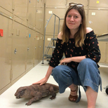
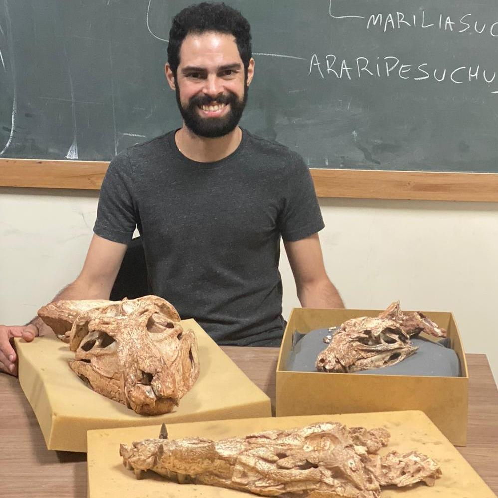

**NOTE FOR DEV:** the assignment between active and inactive is random, it's just to see how it would look like.

## Active contributors

```{=html}
<div class="person-grid">
  <a href="lewis-jones.qmd" class="person-card">
    
    <div class="person-info"><h3>Lewis Jones</h3></div>
  </a>
  <a href="bethany-allen.qmd" class="person-card">
    
    <div class="person-info"><h3>Bethany Allen</h3></div>
  </a>
  <a href="harriet-drage.qmd" class="person-card">
    
    <div class="person-info"><h3>Harriet Drage</h3></div>
  </a>
  <a href="joe-flannery-sutherland.qmd" class="person-card">
    
    <div class="person-info"><h3>Joe Flannery-Sutherland</h3></div>
  </a>
  <a href="will-gearty.qmd" class="person-card">
    
    <div class="person-info"><h3>Will Gearty</h3></div>
  </a>
  <a href="cecily-nicholl.qmd" class="person-card">
    
    <div class="person-info"><h3>Cecily Nicholl</h3></div>
  </a>
  <a href="pedro-godoy.qmd" class="person-card">
    
    <div class="person-info"><h3>Pedro Godoy</h3></div>
  </a>
  <a href="miranta-kouvari.qmd" class="person-card">
    
    <div class="person-info"><h3>Miranta Kouvari</h3></div>
  </a>
  <a href="sofia-galvan.qmd" class="person-card">
    
    <div class="person-info"><h3>Sofía Galván</h3></div>
  </a>
  <a href="christopher-dean.qmd" class="person-card">
    
    <div class="person-info"><h3>Christopher Dean</h3></div>
  </a>
</div>
```

## Past contributors

```{=html}
<div class="person-grid">
  <a href="kilian-eichenseer.qmd" class="person-card">
    
    <div class="person-info"><h3>Kilian Eichenseer</h3></div>
  </a>
  <a href="erin-dillon.qmd" class="person-card">
    
    <div class="person-info"><h3>Erin Dillon</h3></div>
  </a>
  <a href="bruna-farina.qmd" class="person-card">
    
    <div class="person-info"><h3>Bruna Farina</h3></div>
  </a>
  <a href="lucas-buffan.qmd" class="person-card">
    
    <div class="person-info"><h3>Lucas Buffan</h3></div>
  </a>
  <a href="alessandro-chiarenza.qmd" class="person-card">
    
    <div class="person-info"><h3>Alessandro Chiarenza</h3></div>
  </a>
</div>
```
