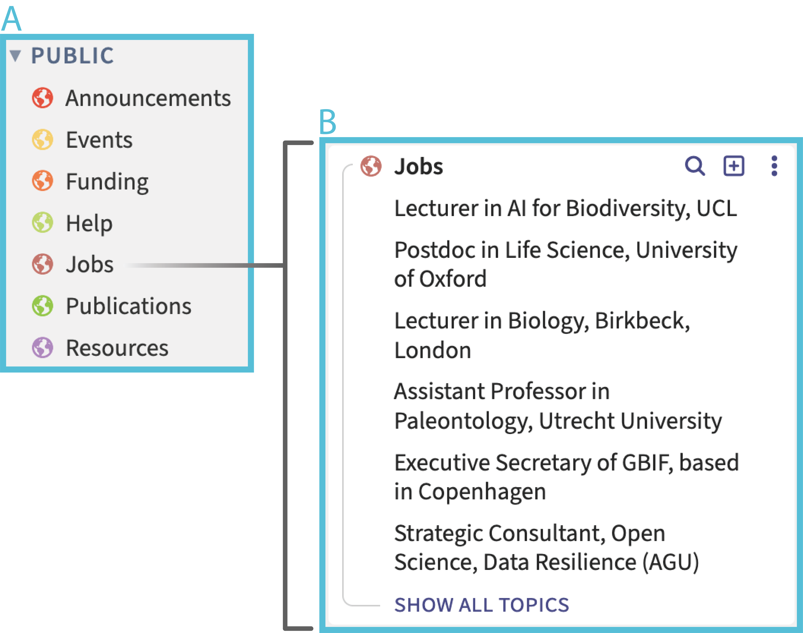
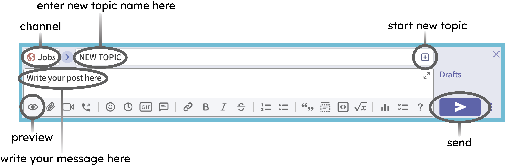
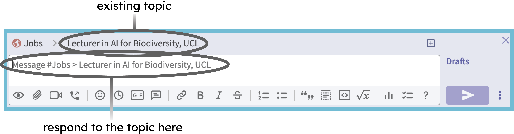
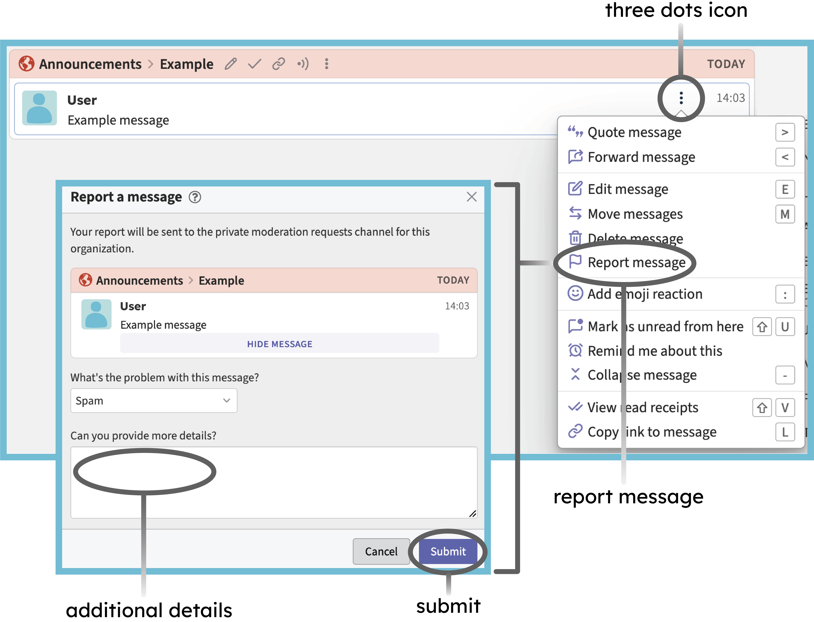
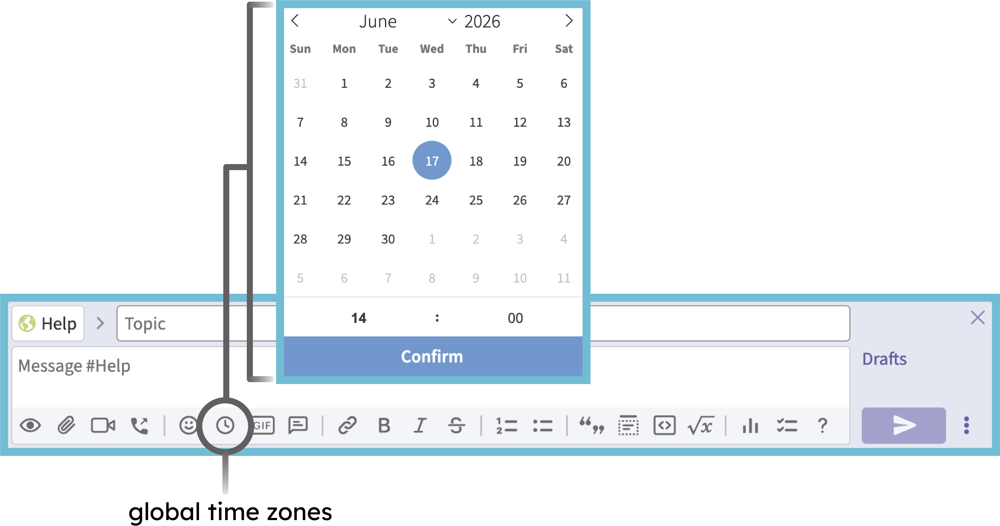

# Zulip User Guide

## Introduction

Zulip is an organized, asynchronous team chat app (mobile and desktop) for distributed teams of all sizes. The application has many useful features that allow for the creation of easy-to-follow, well-organised conversations that will not disappear, and can be viewed/interacted with at any time by users around the world. 

## Zulip Structure & Interaction

Zulip organises conversations into **channels** (listed with a globe icon on the left-hand side of the app/webpage) (Fig. 1A). Each of these covers a broad theme. The Palaeoverse Public Workspace is formed from seven channels:

* Events

* Funding

* Jobs

* Publications

* Resources

* Help

* Announcements

As a guest user, you will be able to post in the first six of these (all channels bar “Announcements”), and interact with all of them. These channels were established by Palaeoverse administrators, and will remain constant. Although you won’t personally be able to create a new channel, we will consider any requests, and you should contact the administrators if you wish to add something new.

 

 

Within each channel, conversations are organised into [**topics**](https://zulip.com/help/introduction-to-topics) (Fig. 1B). This means that many discussions can happen simultaneously within the same channel, and everyone can respond in their own time without the feed becoming confusing. To view the existing topics, just click on the channel you are interested in. When you want to start up a new conversation or post about an opportunity, you should create a new topic as follows (Fig. 2):

* Choose a relevant channel.

* Click the “start a new topic” button (square with a plus symbol inside) located next to the channel name.

* Enter the topic name (see below on how this should be formatted).

* Compose your message relating to the topic in the text box. If you would like to, you can [preview your message](https://zulip.com/help/preview-your-message-before-sending) before it is sent using the eye symbol.

* Click the “send”  button (arrow shaped).

 

 

Once a topic is created, all users will be able to respond to this. When you start composing a response, it will automatically be addressed to the topic that you are reading or have clicked on. This will be confirmed in the textbox with the text: Message \#Channel Name \> Topic Name (Fig. 3). If your message is posted in the wrong place, it may be moved by administrators. Don’t worry if this happens, it is just to keep the space organised!

 

 

## Topic templates

To keep channels easy to navigate, we have provided channel-specific templates that should aim to be used when starting a new topic. Topics within each channel should broadly be formatted as such:

### Conferences & Workshops

The Palaeoverse Zulip workspace welcomes conference and workshop advertisements on the themes of palaeontology and open science, as well as relevant topics such as ecology and conservation science.

Topics posted within the **Conferences & Workshop** channel should aim to take the **full name of the conference or workshop** being advertised. 

The initial post within the topic thread should take the following format:

> **Conference or workshop name (in bold)**
> 
> Location:
> 
> Dates:
> 
> Additional Details (if applicable):
> 
> Link to the conference web page:

All other information (e.g. registration reminders, circular updates) and discussion relating to a specific conference or workshop should be posted below the relevant topic. 

### Publications

Relevant publications on the themes of phylogenetics, palaeobiogeography, palaeoecology, palaeoclimate, diversity dynamics, geometric morphometrics, statistical analyses, conservation, open science, etc., should be posted here.

Topics within the **Publications** channel should take the **full title of the paper**, but shortened versions will be allowed if the title length exceeds 60 characters (Zulip-imposed limit).

The initial post within the topic should aim to take the following format:

> **APA-format citation (in bold)**:
> 
> DOI link:
> 
> Abstract/Additional Details:

All discussion relating to the research paper should be posted below the relevant topic.

### Funding

The Palaeoverse Zulip workspace welcomes all relevant funding advertisements. Grant opportunities are encouraged for all career stages, and can target both academic and non-academic audiences.

Topics within the **Funding** channel should aim to take the grant name and funding body being advertised. 

The initial post within the topic should take the following format:

> **Grant title (in bold)**
> 
> Awarding body:
> 
> Closing Date:
> 
> Additional Details:
> 
> Link to application page

Any other information relating to the funding opportunity should be posted below the relevant topic.

### Resources

The **Resources** channel is broad in its scope. Posts are welcomed on topics such as websites, books, talks, and course materials. As the breadth of subjects posted here cover a wider range, no specific post template is provided; however, the topic title should remain short and descriptive.

All discussion relating to the advertised resource should be posted in the relevant topic thread.

### Help

The **Help** channel can be used for questions relating to the topics of palaeontology, ecology, open science, conservation science, etc. As the breadth of subjects posted here will cover quite a wide range, no template is provided; however, the topic title should remain short and descriptive.

All responses to questions should be placed in the relevant topic thread. 

### Announcements

Posts within the **Announcements** channel will be used for announcements relating to the workspace, e.g. changes in operation, code of conduct, and wider user messages. These messages will only be permitted from members and administrators; however, as a user you will be able to interact with these. 

## Reporting Misconduct

When using the Palaeoverse Zulip Public Workspace, it is important to act in a way that is conducive to a positive and enriching environment. If you discover any instances of unacceptable behaviour that do not align with this ethos (as laid out in our Code of Conduct), we request that you report the incident as follows (Fig. 4):

* Hover over the problematic message to reveal the three dots icon on the right.

* Select “report message”.

* Fill out the requested information. Moderators will see the message you’re reporting when they review your report.

* Click “**Submit**” to send.

 

## Credit/Attribution for Shared Work

### Published work

When sharing work (e.g. published papers, artwork) the appropriate credit should always be provided in the same post if it is not immediately obvious who the work can be attributed to. 

Example 1: a post with a link to a paper does not need to be accompanied by any additional text as all accreditations (e.g. authors and publisher) are made clear within the link.

Example 2: a post comprising a single illustration file should be accompanied by additional text to provide accreditation.

### Unpublished work

Unpublished data should not be posted unless there is explicit approval from its creator/owner. It is important to remember that all posts in the public channels can be viewed by anybody with access to the internet.

## Tips and Tricks for Zulip

**Global time zones**: Zulip features a very useful time-stamping tool which automatically converts the displayed time to the local time zone of whoever is reading it (Fig. 5). To use this:

* Open the compose box for a message.  
* Click the “add global time” clock icon beneath the box.   
* Select your intended Universal Time using the date and time picker.  
* Click Confirm to insert the time code into your message.

 

